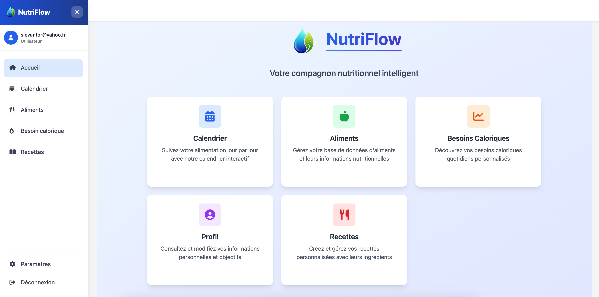
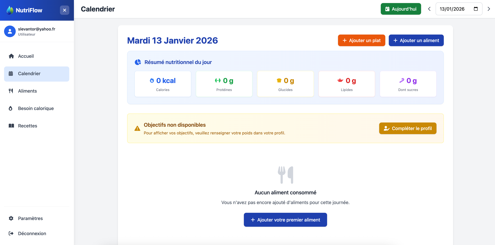
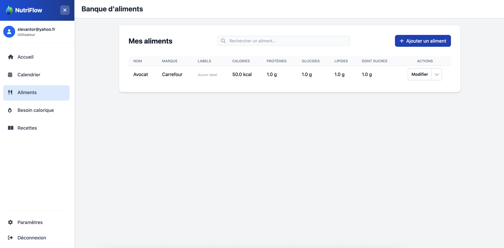
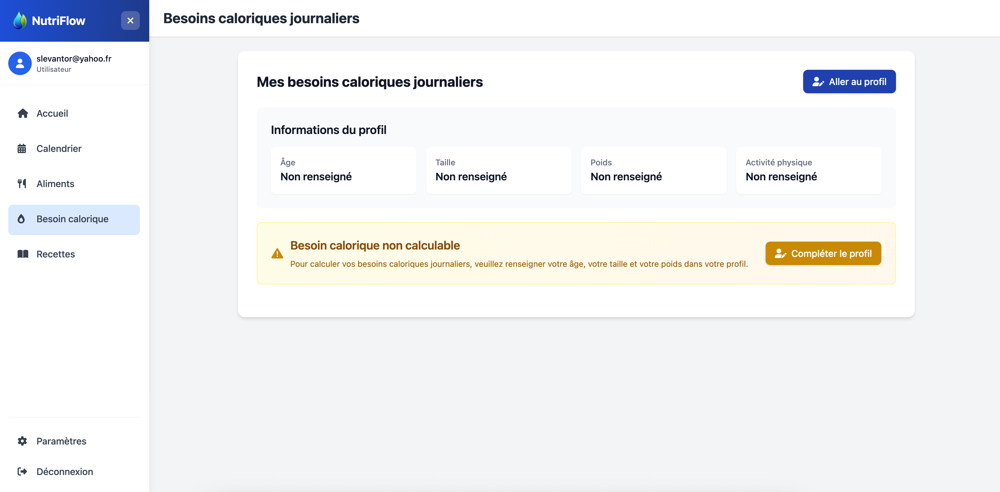
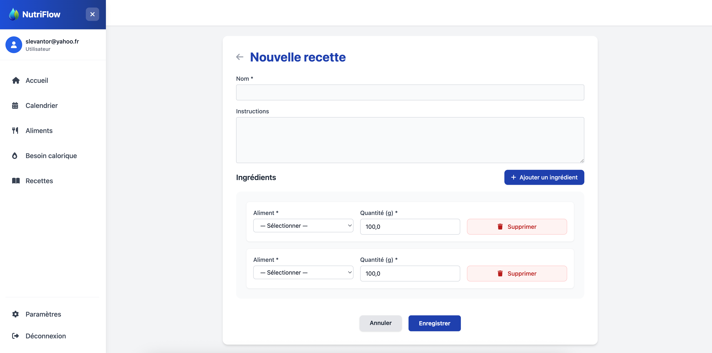

# 🥗 NutriFlow
Application de gestion nutritionnelle et de suivi des calories

# Preview






# Prérequis
- Ruby
- Rails version 8.0.2
- PostgreSQL

# Installation

1. Cloner le repository
```bash
git clone [URL_DU_REPO]
```

2. Installer les dépendances
```bash
bundle install
```

3. Configuration de la base de données
```bash
rails db:create
rails db:migrate
```

4. Lancer le serveur
```bash
rails dev
```

L'application sera accessible à l'adresse `http://localhost:3000`

# Collaborateurs
[Victor Harri-Chal](https://github.com/VictorHarri-Chal)
