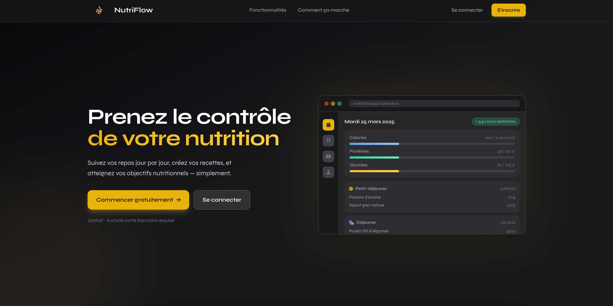
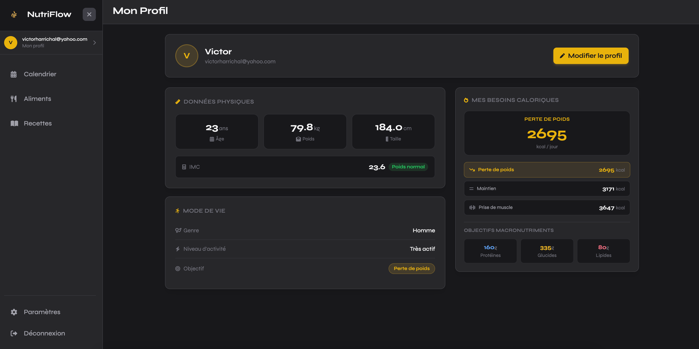
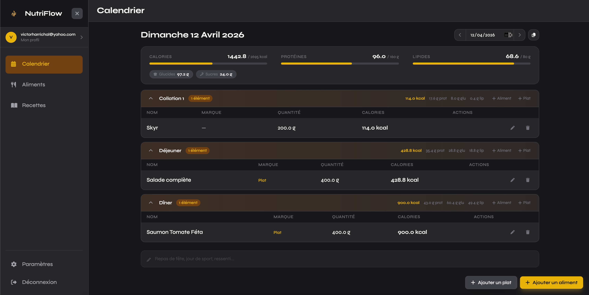
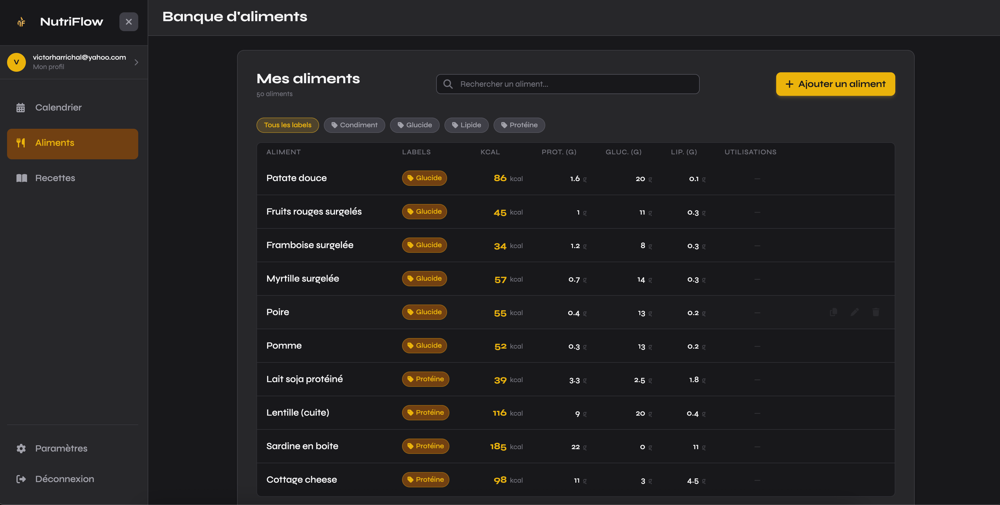
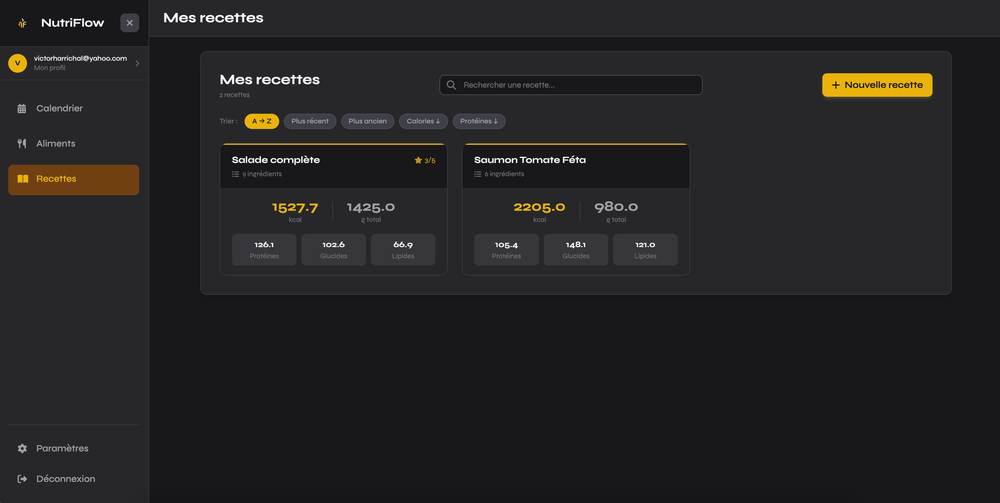

# NutriFlow — Suivi nutritionnel personnel

Application de gestion nutritionnelle : calendrier alimentaire, banque d'aliments, recettes personnalisées, suivi des macros et objectifs journaliers.







---

## Fonctionnalités

| Fonctionnalité         | Description                                                                                          |
| ---------------------- | ---------------------------------------------------------------------------------------------------- |
| Calendrier alimentaire | Ajout d'aliments et de recettes par jour, groupes de repas configurables, résumé macro en temps réel |
| Banque d'aliments      | Création, recherche (pg_search + Ransack), filtres par étiquettes, pagination                        |
| Recettes               | Recettes multi-ingrédients avec calcul nutritionnel automatique et notation personnelle              |
| Objectifs journaliers  | Calcul BMR Mifflin-St Jeor via Dentaku, objectifs caloriques/macros selon le profil                  |
| Profil & paramètres    | Poids, taille, âge, sexe, niveau d'activité, objectif (perte de poids / maintien / prise de masse)   |

---

## Stack

| Catégorie                 | Outil                                                      |
| ------------------------- | ---------------------------------------------------------- |
| Framework                 | Ruby on Rails 8.0.2                                        |
| Base de données           | PostgreSQL                                                 |
| Frontend                  | Tailwind CSS v3, Hotwire (Turbo + Stimulus), ViewComponent |
| Auth / Forms / Pagination | Devise, Simple Form, Pagy                                  |
| Recherche                 | pg_search, Ransack                                         |
| Calculs BMR               | Dentaku (évaluateur d'expressions runtime)                 |
| Déploiement               | Kamal (Docker)                                             |

---

## Prérequis

- Ruby **3.4.2**
- PostgreSQL >= 14
- Node.js (pour Tailwind en développement)

---

## Installation

```bash
# 1. Cloner le dépôt
git clone https://github.com/VictorHarri-Chal/NutriFlow
cd NutriFlow

# 2. Installer les dépendances
bundle install

# 3. Configurer les variables d'environnement
cp .env.example .env
# Renseigner DATABASE_URL ou les identifiants PostgreSQL locaux

# 4. Créer et migrer la base
bin/rails db:create db:migrate

# 5. Lancer le serveur (Rails + Tailwind en parallèle)
bin/dev
```

L'application est accessible sur `http://localhost:3000`.

Créez votre compte directement depuis la page d'accueil via le bouton **Créer un compte**.

---

## Variables d'environnement

| Variable                       | Usage                                   | Requis en production |
| ------------------------------ | --------------------------------------- | -------------------- |
| `NUTRI_FLOW_DATABASE_PASSWORD` | Mot de passe PostgreSQL en production   | ✅                   |
| `RAILS_MASTER_KEY`             | Clé de déchiffrement des credentials    | ✅                   |
| `DATABASE_URL`                 | URL complète de connexion (alternative) | Optionnel            |

---

## Déploiement

Le projet cible un déploiement **Kamal** (Docker). La configuration est dans `config/deploy.yml`.

```bash
kamal deploy
```

---

## Auteur

[Victor Harri-Chal](https://github.com/VictorHarri-Chal)
