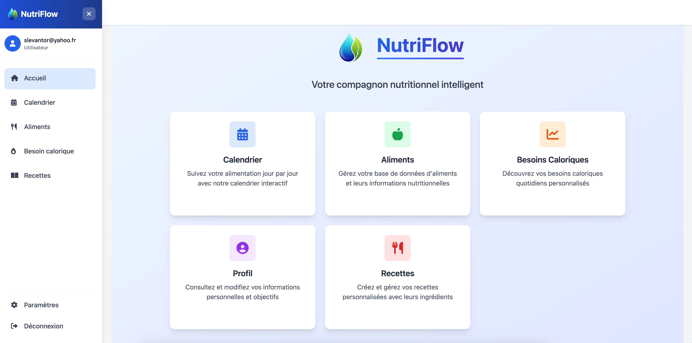
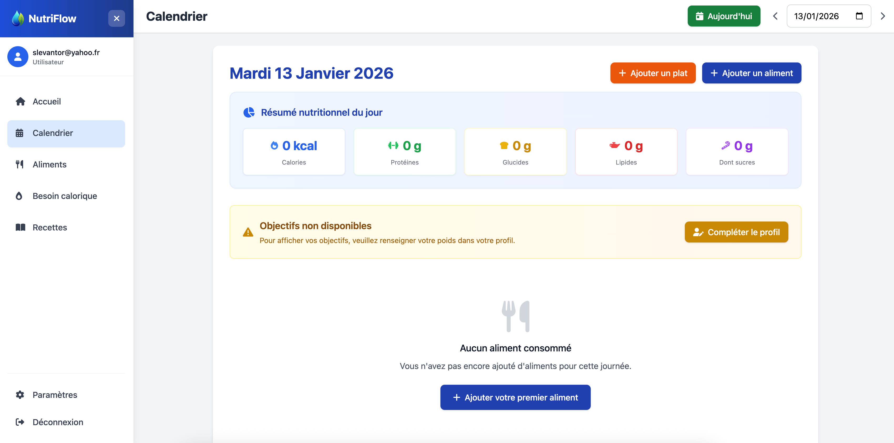
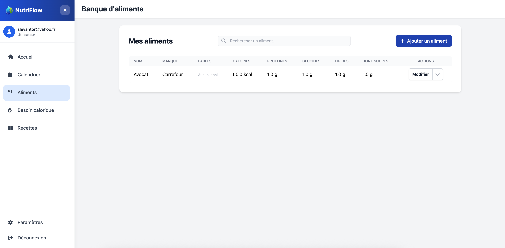
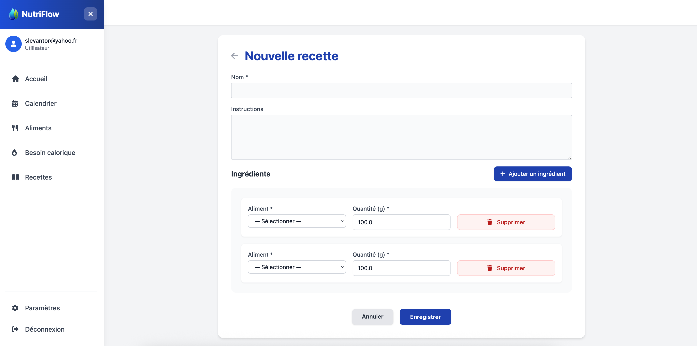

# NutriFlow — Suivi nutritionnel personnel

Application de gestion nutritionnelle : calendrier alimentaire, banque d'aliments, recettes personnalisées, suivi des macros et objectifs journaliers.







---

## Fonctionnalités

| Fonctionnalité         | Description                                                                                       |
| ---------------------- | ------------------------------------------------------------------------------------------------- |
| Calendrier alimentaire | Ajout d'aliments et de recettes par jour, groupes de repas, résumé macro en temps réel (Turbo)   |
| Banque d'aliments      | Création, recherche (pg_search + Ransack), filtres par étiquettes, pagination                     |
| Recettes               | Recettes multi-ingrédients avec calcul nutritionnel automatique, notation et commentaires         |
| Objectifs journaliers  | Calcul BMR Harris-Benedict via Dentaku, objectifs caloriés/protéines/lipides selon le profil      |
| Profil & paramètres    | Poids, taille, âge, sexe, niveau d'activité, objectif (perte/maintien/prise de masse)            |

---

## Stack

| Catégorie    | Outil                                                        |
| ------------ | ------------------------------------------------------------ |
| Framework    | Ruby on Rails 8.0.2                                          |
| Base de données | PostgreSQL                                                |
| Frontend     | Tailwind CSS v3, Hotwire (Turbo + Stimulus), ViewComponent   |
| Auth / Forms / Pagination | Devise, Simple Form, Pagy                       |
| Recherche    | pg_search, Ransack                                           |
| Calculs BMR  | Dentaku (évaluateur d'expressions runtime)                   |
| Déploiement  | Kamal (Docker)                                               |

---

## Prérequis

- Ruby **3.4.2**
- PostgreSQL >= 14
- Node.js (pour Tailwind en développement)

---

## Installation

```bash
# 1. Cloner le dépôt
git clone <URL_DU_REPO>
cd NutriFlow

# 2. Installer les dépendances
bundle install

# 3. Configurer les variables d'environnement
cp .env.example .env
# Renseigner DATABASE_URL ou les identifiants PostgreSQL locaux

# 4. Créer et migrer la base
bin/rails db:create db:migrate

# 5. Lancer le serveur (Rails + Tailwind en parallèle)
bin/dev
```

L'application est accessible sur `http://localhost:3000`.

Créez votre compte directement depuis la page d'accueil via le bouton **Créer un compte**.

---

## Variables d'environnement

| Variable                      | Usage                                  | Requis en production |
| ----------------------------- | -------------------------------------- | -------------------- |
| `NUTRI_FLOW_DATABASE_PASSWORD` | Mot de passe PostgreSQL en production | ✅                   |
| `RAILS_MASTER_KEY`            | Clé de déchiffrement des credentials  | ✅                   |
| `DATABASE_URL`                | URL complète de connexion (alternative)| Optionnel            |

---

## Déploiement

Le projet cible un déploiement **Kamal** (Docker). La configuration est dans `config/deploy.yml`.

```bash
kamal deploy
```

---

## Usage de l'IA

**Outil utilisé** : Claude Code (claude-sonnet-4-6) via CLI, avec un `CLAUDE.md` rédigé en amont pour contraindre la stack, les conventions et le style de code.

**Ce que l'IA a assisté** : planification des fonctionnalités, boilerplate Tailwind, configuration Devise/Simple Form, squelettes de migrations, audit de code (bugs, N+1, incohérences), ce README.

**Ce que j'ai décidé et arbitré** :
- Modèle de données : `Day` → `DayFood`/`DayRecipe` avec groupes de repas optionnels
- Calcul BMR via Dentaku plutôt qu'une gem de calcul nutritionnel
- Architecture Stimulus : un controller par comportement JS justifié
- Lecture et validation de chaque fichier généré — tout le code est explicable ligne par ligne

---

## Auteur

[Victor Harri-Chal](https://github.com/VictorHarri-Chal)
